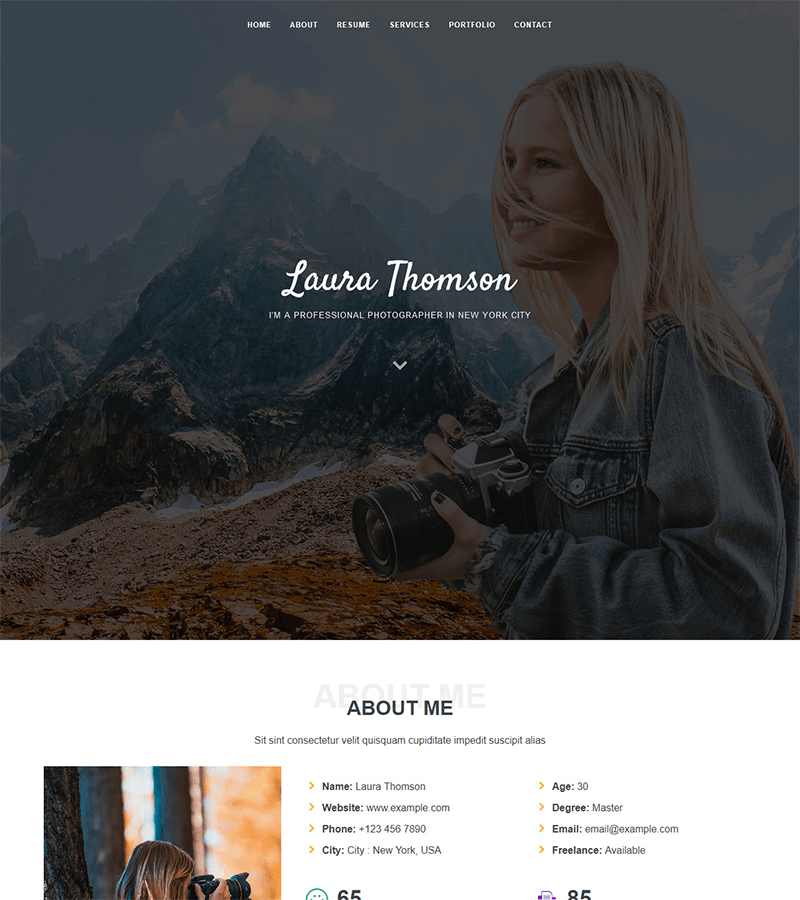

# Laura
One Page Bootstrap 4 Bat Flat CMS Themes

## How To Use
To use single page template, create new page and select its template to one-page.html.

Go to setting --> themes, and then edit one-page.html to your liking. It is recomended to copy each section of the templates and create sniipets of it to the one-page.html so that you can directly edit sections via snippets.

To make contact form working, just create new form page with slug "contact".

##license
Based on Bootstrapmade Templtate - Laura
https://bootstrapmade.com/demo/themes/Laura/

Please do not remove the credits unless you buy theme here:
https://bootstrapmade.com/laura-free-creative-bootstrap-theme/

My Web Demo (Customized) : http://reza.is-great.net/